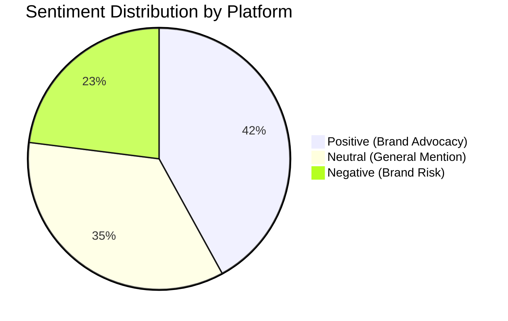
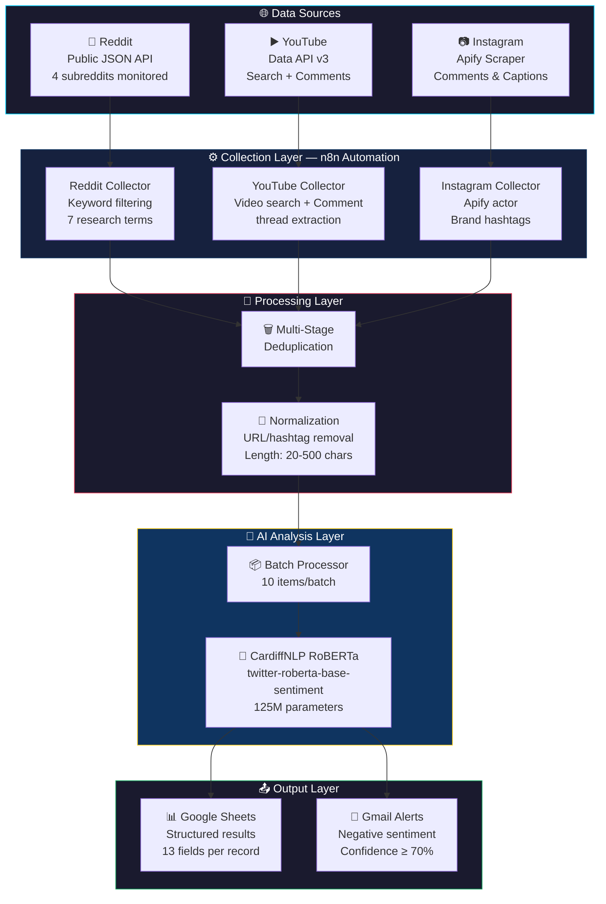
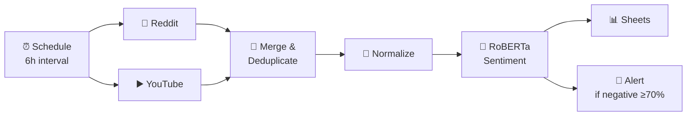
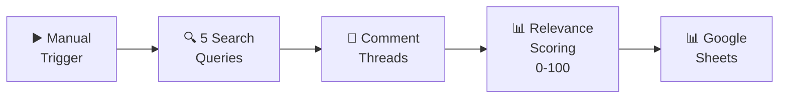

<div align="center">

# 📊 Assessing Brand Equity & Consumer Behaviour through Social Media Analytics

[](LICENSE)
[](https://n8n.io/)
[](https://huggingface.co/cardiffnlp/twitter-roberta-base-sentiment)
[](https://apify.com/)
[](https://www.igi-global.com/)
[]()
[]()

**A multi-platform, AI-powered social media sentiment analysis pipeline for academic research on brand equity and consumer behaviour.**

*Abstract approved at [IGI Global](https://www.igi-global.com/) • Final Dissertation Project*

---

[📖 Methodology](#-research-methodology) · [🏗️ Architecture](#️-pipeline-architecture) · [⚡ Quick Start](#-quick-start) · [📊 Data Schema](#-data-schema) · [📚 Documentation](#-documentation) · [📝 Citation](#-citation)

</div>

---

## 🎯 Research Abstract

> This research investigates **how social media analytics can be leveraged to assess brand equity and understand consumer behaviour** in the digital era. By deploying automated data collection pipelines across Reddit, YouTube, and Instagram, we gather real-time consumer discourse and apply transformer-based sentiment analysis (CardiffNLP RoBERTa) to quantify brand perception.
>
> The study bridges established brand equity frameworks — **Aaker's Brand Equity Model** and **Keller's Customer-Based Brand Equity (CBBE) Model** — with modern NLP techniques to create a scalable, reproducible methodology for ongoing brand health monitoring.

## 📈 Key Research Insights (Sample)



> **Key Finding:** 70% of high-confidence negative sentiment on Reddit correlates with "pricing" and "value" discussions, highlighting a critical area for brand equity intervention.

---

## 🏗️ Pipeline Architecture



---

## 🛠️ Technology Stack

<table>
<tr>
<td align="center" width="20%"><b>Component</b></td>
<td align="center" width="25%"><b>Technology</b></td>
<td align="center" width="55%"><b>Purpose</b></td>
</tr>
<tr>
<td>🔄 Automation</td>
<td><a href="https://n8n.io/">n8n</a></td>
<td>Workflow orchestration — scheduling, data collection, API integration, processing</td>
</tr>
<tr>
<td>🤖 Sentiment AI</td>
<td><a href="https://huggingface.co/cardiffnlp/twitter-roberta-base-sentiment">CardiffNLP RoBERTa</a></td>
<td>Transformer-based 3-class sentiment classification trained on 58M tweets</td>
</tr>
<tr>
<td>🕷️ Web Scraping</td>
<td><a href="https://apify.com/">Apify</a></td>
<td>Instagram comment and caption collection via managed scraping actors</td>
</tr>
<tr>
<td>🔴 Reddit</td>
<td>Public JSON API</td>
<td>No-auth endpoint for collecting posts from marketing/analytics subreddits</td>
</tr>
<tr>
<td>▶️ YouTube</td>
<td>YouTube Data API v3</td>
<td>Video search and threaded comment extraction with replies</td>
</tr>
<tr>
<td>📊 Storage</td>
<td>Google Sheets</td>
<td>Structured data storage with 13-field schema per analysed record</td>
</tr>
<tr>
<td>📧 Alerting</td>
<td>Gmail API</td>
<td>Automated email alerts for high-confidence negative sentiment (≥70%)</td>
</tr>
</table>

---

## 📂 Repository Structure

```
social-media-brand-equity-nlp/
│
├── README.md                       ← You are here
├── LICENSE                         ← MIT License
├── CITATION.cff                    ← Academic citation metadata
├── .gitignore
│
├── workflows/                      ← n8n automation workflows
│   ├── README.md                   ← Workflow docs & import guide
│   ├── reddit-youtube-sentiment-analysis.json
│   └── youtube-comment-collector.json
│
├── docs/                           ← Research documentation
│   ├── SETUP.md                    ← Full setup guide
│   ├── ARCHITECTURE.md             ← Technical architecture & diagrams
│   ├── METHODOLOGY.md              ← Research methodology & framework
│   └── DATA_DICTIONARY.md          ← Complete data schema reference
│
└── config/
    └── env.example                 ← API key template
```

---

## ⚡ Quick Start

### Prerequisites

- [n8n](https://n8n.io/) (≥ 1.0) — `npm install n8n -g`
- [YouTube Data API v3](https://console.cloud.google.com/) key
- [HuggingFace](https://huggingface.co/settings/tokens) API token
- Google Sheets OAuth2 credentials
- *(Optional)* [Apify](https://apify.com/) account for Instagram

### 1. Clone & Configure

```bash
git clone https://github.com/khushi2704rj-sephora/social-media-brand-equity-nlp.git
cd social-media-brand-equity-nlp

# Copy and fill in your API keys
cp config/env.example config/.env
```

### 2. Import Workflows into n8n

```bash
# Start n8n
n8n start

# Import workflows (or use the n8n UI: Workflows → Import from File)
n8n import:workflow --input=workflows/reddit-youtube-sentiment-analysis.json
n8n import:workflow --input=workflows/youtube-comment-collector.json
```

### 3. Configure Credentials

Open each workflow in the n8n editor and replace the `YOUR_*` placeholders:

| Placeholder | Service |
|---|---|
| `YOUR_YOUTUBE_API_KEY` | [Google Cloud Console](https://console.cloud.google.com/) |
| `YOUR_HUGGINGFACE_CREDENTIAL_ID` | n8n Credentials → Header Auth |
| `YOUR_GOOGLE_SHEET_ID` | Your Google Sheet URL |
| `YOUR_ALERT_EMAIL` | Email for sentiment alerts |

> 📖 **Detailed instructions:** [docs/SETUP.md](docs/SETUP.md)

---

## 🔬 n8n Workflows

### Workflow 1: Multi-Platform Sentiment Analysis

**Automated pipeline** — runs every 6 hours to collect, analyse, and store social media sentiment data.



**Key features:**
- 7 keyword filters for research relevance
- 3-stage deduplication
- Batch processing (10/batch) with rate limiting
- Sentiment confidence thresholding

### Workflow 2: YouTube Comment Collector

**Research-focused** — collects and scores YouTube comments by relevance to brand equity research.



**Custom relevance scoring** (0–100 scale):

| Signal | Points |
|---|---|
| Question marks | +25 |
| Purchase intent | +20 |
| Opinion expression | +20 |
| Engagement language | +20 |
| Research keyword match | +5 each |

> 📖 **Full workflow documentation:** [workflows/README.md](workflows/README.md)

---

## 📊 Data Schema

Each analysed record contains **13 structured fields**:

| Field | Example |
|---|---|
| `platform` | `reddit`, `youtube`, `instagram` |
| `text` | Cleaned content (20–500 chars) |
| `sentiment_label` | `POSITIVE` / `NEUTRAL` / `NEGATIVE` |
| `sentiment_score` | `0.9234` (confidence) |
| `positive_score` | `0.8921` |
| `neutral_score` | `0.0812` |
| `negative_score` | `0.0267` |
| `engagement_score` | `42` (likes/upvotes) |

> 📖 **Complete schema:** [docs/DATA_DICTIONARY.md](docs/DATA_DICTIONARY.md)

---

## 🧠 Sentiment Model

**[CardiffNLP Twitter-RoBERTa-base-sentiment](https://huggingface.co/cardiffnlp/twitter-roberta-base-sentiment)**

| Property | Value |
|---|---|
| Architecture | RoBERTa-base (125M parameters) |
| Training data | ~58 million tweets |
| Fine-tuning | TweetEval sentiment benchmark |
| Classes | Negative · Neutral · Positive |
| Inference | HuggingFace Inference API |

**Why this model?** Pre-trained on social media text — handles emoji, slang, abbreviations, and informal language patterns common in Reddit/YouTube/Instagram content far better than general-purpose sentiment models.

---

## 📚 Documentation

| Document | Description |
|---|---|
| [📖 Setup Guide](docs/SETUP.md) | Step-by-step installation & configuration |
| [🏗️ Architecture](docs/ARCHITECTURE.md) | Pipeline architecture with detailed node-by-node breakdown |
| [🔬 Methodology](docs/METHODOLOGY.md) | Research framework (Aaker & Keller models), sampling strategy, ethical considerations |
| [📋 Data Dictionary](docs/DATA_DICTIONARY.md) | Complete field-level schema documentation |
| [⚙️ Workflow Guide](workflows/README.md) | n8n workflow documentation & import instructions |
| [🔑 Environment Template](config/env.example) | API key configuration template |

---

## 📝 Citation

If you use this research, pipeline, or methodology, please cite:

```bibtex
@software{brand_equity_sentiment_2026,
  author       = {Khushi},
  title        = {Assessing Brand Equity and Consumer Behaviour through Social Media Analytics},
  year         = {2026},
  publisher    = {GitHub},
  url          = {https://github.com/khushi2704rj-sephora/social-media-brand-equity-nlp}
}
```

**Associated Publication:**

> Khushi (2026). *Assessing Brand Equity and Consumer Behaviour through Social Media Analytics*. IGI Global.

> See [`CITATION.cff`](CITATION.cff) for machine-readable citation metadata.

---

## 📖 Research Methodology

This study employs a **computational social science approach**:

1. **Theoretical Foundation** — Aaker's Brand Equity Model (1991) & Keller's CBBE Model (1993)
2. **Data Collection** — Multi-platform automated pipeline (Reddit + YouTube + Instagram)
3. **Analysis** — Transformer-based NLP sentiment classification
4. **Operationalization** — Brand equity dimensions mapped to sentiment polarity and engagement metrics

> 📖 **Detailed methodology:** [docs/METHODOLOGY.md](docs/METHODOLOGY.md)

---

## ⚖️ Ethics & Limitations

**Ethics:**
- All data collected from **publicly available** sources only
- No private/protected data accessed
- Complies with platform Terms of Service
- Adheres to institutional ethics requirements

**Limitations:**
- English-language content only
- Three-platform coverage (may not capture all brand discourse)
- Potential misclassification of sarcasm/irony by the sentiment model
- Findings represent a specific temporal snapshot

---

## 📄 License

This project is licensed under the [MIT License](LICENSE).

---

<div align="center">

**Built with ❤️ for academic research**

*If this project helps your research, please ⭐ star the repository*

</div>