# Pipeline Architecture

Detailed technical architecture of the multi-platform social media sentiment analysis system.

## System Overview

```mermaid
graph TB
    subgraph "Data Sources"
        R["🔴 Reddit<br/>Public JSON API"]
        Y["🔴 YouTube<br/>Data API v3"]
        I["📷 Instagram<br/>Apify Scraper"]
    end

    subgraph "Collection Layer (n8n)"
        R --> RC["Reddit Collector<br/><i>Posts from r/marketing,<br/>r/socialmedia, r/Entrepreneur,<br/>r/analytics</i>"]
        Y --> YS["YouTube Search<br/><i>Video discovery by<br/>research keywords</i>"]
        YS --> YC["Comment Collector<br/><i>Thread extraction<br/>with replies</i>"]
        I --> IC["Instagram Collector<br/><i>Apify actor for<br/>comments & captions</i>"]
    end

    subgraph "Processing Layer"
        RC --> DD["Deduplication<br/><i>Multi-stage by text,<br/>author, timestamp</i>"]
        YC --> DD
        IC --> DD
        DD --> NM["Normalization<br/><i>URL/hashtag removal,<br/>length filtering (20-500),<br/>schema standardization</i>"]
    end

    subgraph "Analysis Layer"
        NM --> BA["Batch Processor<br/><i>10 items/batch<br/>with rate limiting</i>"]
        BA --> SA["🤖 Sentiment Analysis<br/><i>CardiffNLP RoBERTa<br/>via HuggingFace API</i>"]
        SA --> SP["Score Parser<br/><i>3-class: Positive,<br/>Neutral, Negative</i>"]
    end

    subgraph "Output Layer"
        SP --> GS["📊 Google Sheets<br/><i>All analyzed data</i>"]
        SP --> FN["Filter: Negative ≥70%"]
        FN --> GM["📧 Gmail Alert<br/><i>High-confidence<br/>negative sentiment</i>"]
    end

    style R fill:#FF4500,color:#fff
    style Y fill:#FF0000,color:#fff
    style I fill:#E4405F,color:#fff
    style SA fill:#FFD21E,color:#000
    style GS fill:#0F9D58,color:#fff
    style GM fill:#D44638,color:#fff
```



---

## Workflow 1: Reddit + YouTube Sentiment Analysis

### Node-by-Node Breakdown



```mermaid
flowchart LR
    A["⏰ Schedule<br/>Every 6h"] --> B["🔴 Get Reddit<br/>Posts"]
    A --> C["🔴 Search YouTube<br/>Videos"]

    B --> D["📝 Parse Reddit"]
    C --> E["🔗 Extract<br/>Video IDs"]
    E --> F["💬 Get YouTube<br/>Comments"]
    F --> G["📝 Parse YouTube<br/>Comments"]

    D --> H["🗑️ Dedup Reddit"]
    G --> I["🗑️ Dedup YouTube"]

    H --> J["🔀 Merge"]
    I --> J

    J --> K["🗑️ Dedup Merged"]
    K --> L["📐 Normalize"]
    L --> M["📦 Batch<br/>n=10"]
    M --> N["🤖 HuggingFace<br/>Sentiment"]
    N --> O["⏳ Wait"]
    O --> M

    M --> P["📊 Parse<br/>Results"]
    P --> Q{"🔍 Negative<br/>≥70%?"}
    Q -- "Yes" --> R["📧 Gmail Alert"]
    Q -- "All" --> S["📊 Google Sheets"]
```

### Data Transformations

| Stage | Input | Transformation | Output |
|---|---|---|---|
| **Reddit Parse** | Raw JSON response | Filter by keywords, extract metadata | `{id, title, text, author, subreddit, score, url, platform}` |
| **YouTube Parse** | Video search results + comment threads | Extract video/comment metadata | `{id, text, author, videoId, likes, platform}` |
| **Normalize** | Mixed platform data | Remove URLs/hashtags/mentions, filter by length (20-500 chars) | Standardized `{id, text, author, platform, engagement, url, researchTopic}` |
| **Sentiment Score** | Text input | HuggingFace RoBERTa inference | `{sentiment, sentimentScore, positiveScore, neutralScore, negativeScore}` |

### Reddit Keywords Filter

The pipeline filters Reddit posts containing any of these terms:
- `social media analytics`
- `brand equity`
- `consumer behavior`
- `brand perception`
- `brand sentiment`
- `social listening`
- `brand reputation`

### Subreddits Monitored

| Subreddit | Focus |
|---|---|
| r/marketing | General marketing discussions |
| r/socialmedia | Social media strategy & trends |
| r/Entrepreneur | Business & brand building |
| r/analytics | Data analytics approaches |

---

## Workflow 2: YouTube Comment Collector

### Node-by-Node Breakdown



```mermaid
flowchart LR
    A["▶️ Manual<br/>Start"] --> B["⚙️ Config"]
    B --> C["📋 Prepare<br/>Searches"]
    C --> D["🔍 Search<br/>YouTube"]
    D --> E["🔗 Extract<br/>Video IDs"]
    E --> F["💬 Fetch<br/>Comments"]
    F --> G["📝 Parse<br/>Comments"]
    G --> H["📊 Filter<br/>& Score"]
    H --> I["🗑️ Dedup"]
    I --> J["📊 Google<br/>Sheets"]
```

### Relevance Scoring Algorithm

Comments are scored on a 0–100 scale based on engagement signals:

```
Score = Question(25) + BuyIntent(20) + Opinion(20) + Engagement(20) + Keywords(5 × n)
```

**Signal Detection Patterns:**

| Signal | Detection Pattern | Points |
|---|---|---|
| Question | Contains `?` | +25 |
| Buy Intent | `buy`, `purchase`, `price`, `cost`, `worth`, `sell` | +20 |
| Opinion | `think`, `feel`, `love`, `hate`, `best`, `worst`, `better`, `good`, `bad` | +20 |
| Engagement | `help`, `recommend`, `suggest`, `advice`, `thank` | +20 |
| Keyword Match | Research-specific terms (brand, consumer, loyalty, etc.) | +5 each |

**Minimum threshold:** Comments must have ≥ 1 engagement signal and ≥ 20 characters to be included.

---

## Sentiment Model

### CardiffNLP Twitter-RoBERTa-base-sentiment

| Property | Details |
|---|---|
| **Architecture** | RoBERTa-base (125M parameters) |
| **Training Data** | ~58M tweets |
| **Fine-tuning** | TweetEval sentiment benchmark |
| **Classes** | LABEL_0 (Negative), LABEL_1 (Neutral), LABEL_2 (Positive) |
| **API Endpoint** | `https://router.huggingface.co/hf-inference/models/cardiffnlp/twitter-roberta-base-sentiment` |

**Why this model?**
- Pre-trained on social media text (tweets) — better performance on informal, short-form text
- State-of-the-art results on social media sentiment benchmarks
- Free inference API via HuggingFace
- Handles emoji, slang, and internet language patterns

---

## Data Flow Summary

```
┌─────────────┐     ┌─────────────┐     ┌─────────────┐
│   Reddit    │     │   YouTube   │     │  Instagram  │
│  Public API │     │  Data API   │     │   Apify     │
└──────┬──────┘     └──────┬──────┘     └──────┬──────┘
       │                   │                   │
       └───────────┬───────┘                   │
                   ▼                           │
          ┌────────────────┐                   │
          │  n8n Automation │◄──────────────────┘
          │    Pipeline     │
          └───────┬────────┘
                  ▼
          ┌────────────────┐
          │ Text Cleaning  │
          │ & Normalization│
          └───────┬────────┘
                  ▼
          ┌────────────────┐
          │  HuggingFace   │
          │ RoBERTa Model  │
          └───────┬────────┘
                  ▼
         ┌─────────────────┐
         │  Google Sheets   │
         │  (Structured     │
         │   Analysis Data) │
         └─────────────────┘
```
